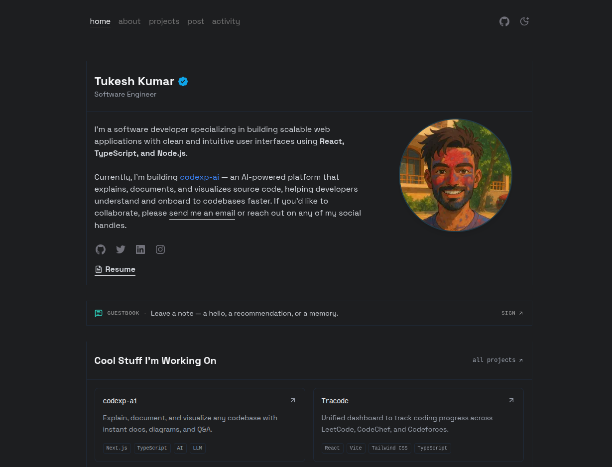

<div align="center">

# tukesh.in

**A clean, fast, content-first developer portfolio built with Next.js 15, React 19, and Tailwind CSS.**

[](https://nextjs.org/)
[](https://react.dev/)
[](https://www.typescriptlang.org/)
[](https://tailwindcss.com/)
[](./LICENSE)

[**Live demo →**](https://tukesh.in)



</div>

---

## Why this repo?

Most portfolio templates are either bloated with carousels and parallax, or so minimal that they feel unfinished. This one aims for a different middle:

- **Content-first.** Projects, experience, and activity are plain data files — update one file, ship.
- **Fast.** Static generation, shared-chunk budget under ~105 kB, Lighthouse 95+ across the board.
- **Real signals.** Live GitHub contribution graph, auto-synced activity feed (GitHub + WakaTime), MDX blog.
- **Typed.** Strict TypeScript end-to-end. No `any` escape hatches.

## Features

- **Home / About / Projects / Blog / Activity / Guestbook** — six clear pages, each a single data file (or env var) away from yours.
- **Featured projects** surface on the homepage via a single `featured: true` flag.
- **Live activity feed** pulls commits, PRs, and coding sessions from GitHub + WakaTime (revalidated every 60s).
- **Signed guestbook.** Visitors sign in with GitHub and leave one public note. Admin can pin + delete.
- **MDX blog** with syntax highlighting, JSON-LD, and SEO metadata per post.
- **GitHub contribution calendar** with light/dark themes.
- **SEO ready.** Sitemap, OpenGraph, Twitter cards, JSON-LD (`Person`, `WebSite`, `ProfilePage`, `BlogPosting`).
- **PWA manifest**, proper theme-color meta, and RSS alternate link.
- **Dark / light theme** with `next-themes` (respects system preference, no flash).
- **Accessibility minded.** Reduced-motion respected, focus states, semantic structure.

## Tech stack

| Layer       | Choice                                                                 |
| ----------- | ---------------------------------------------------------------------- |
| Framework   | [Next.js 15](https://nextjs.org/) (App Router) + React 19              |
| Language    | TypeScript 5 (strict)                                                  |
| Styling     | Tailwind CSS 3 + `@tailwindcss/typography`                             |
| UI          | Radix UI primitives, `lucide-react`, Framer Motion                     |
| Content     | MDX via `next-mdx-remote`, `gray-matter` for frontmatter               |
| Data        | GitHub REST API + WakaTime API (server-side, cached)                   |
| Typography  | [Space Grotesk](https://fonts.google.com/specimen/Space+Grotesk)       |

## Quick start

```bash
# 1. Clone
git clone https://github.com/tukesh1/tukesh.in.git
cd tukesh.in

# 2. Install
npm install

# 3. (Optional) set env vars for the /activity and /guestbook pages
cp .env.example .env.local
#    - GITHUB_TOKEN         raises the GitHub rate limit (10 → 30 req/min)
#    - WAKATIME_API_KEY     required for coding-session stats
#    - AUTH_SECRET + AUTH_GITHUB_*  required for /guestbook sign-in
#    - UPSTASH_REDIS_REST_* required for /guestbook storage

# 4. Dev
npm run dev        # http://localhost:3000
```

### Guestbook setup

The `/guestbook` page uses GitHub OAuth (via Auth.js v5) and Upstash Redis. Without
these env vars, the page still renders — it just shows a friendly "not configured"
card instead of a form.

1. **Auth secret** — generate one:
   ```bash
   openssl rand -base64 32   # paste into AUTH_SECRET
   ```
2. **GitHub OAuth App** — [Settings → Developer settings → OAuth Apps → New](https://github.com/settings/developers).
   Callback URL: `https://<your-domain>/api/auth/callback/github`
   (for local dev: `http://localhost:3000/api/auth/callback/github`).
   Copy the client id / secret into `AUTH_GITHUB_ID` + `AUTH_GITHUB_SECRET`.
3. **Upstash Redis** — create a free database at [console.upstash.com/redis](https://console.upstash.com/redis),
   copy the REST URL + token into `UPSTASH_REDIS_REST_URL` + `UPSTASH_REDIS_REST_TOKEN`.
4. **Admin** — set `ADMIN_GITHUB_USERNAME` to your GitHub username to unlock
   per-message pin/unpin and delete.

### Scripts

| Command         | What it does                         |
| --------------- | ------------------------------------ |
| `npm run dev`   | Start the dev server                 |
| `npm run build` | Production build (static + SSG)      |
| `npm start`     | Serve the production build           |
| `npm run lint`  | Run ESLint (`next/core-web-vitals`)  |

## Project structure

```
src/
├── app/                 # Next.js App Router pages (routes only)
│   ├── about/           # /about
│   ├── activity/        # /activity — live GitHub + WakaTime feed
│   ├── post/            # /post & /post/[slug] — MDX blog
│   ├── projects/        # /projects
│   ├── layout.tsx       # Root layout, fonts, metadata, theme provider
│   ├── page.tsx         # Home
│   ├── not-found.tsx    # 404
│   ├── manifest.ts      # PWA manifest
│   └── sitemap.ts       # Dynamic sitemap
│
├── components/          # Reusable UI
│   ├── about/           # About-page sections (experience, skills, tools…)
│   ├── icons/           # Inline SVG icons (kept small, tree-shakable)
│   └── *.tsx            # Header, footer, panel, mdx-content, etc.
│
├── content/             # MDX blog posts
│
├── data/
│   ├── json/                # Edit ONLY these files to personalise
│   │   ├── site.json        # Name, description, social links, SEO keywords
│   │   ├── projects.json    # Your projects (set featured:true for homepage)
│   │   ├── experience.json  # Work history (supports **bold** and [links](url))
│   │   ├── skills.json      # Skill grid with icon keys
│   │   ├── tools.json       # Tool stack with icon keys
│   │   ├── socials.json     # Social icons shown on the home page
│   │   └── certifications.json
│   │
│   ├── icon-map.tsx     # Maps icon key strings → React components (add new icons here)
│   ├── siteMetadata.ts  # Thin adapter — reads site.json
│   ├── projects.ts      # Thin adapter — reads projects.json
│   ├── experience.tsx   # Thin adapter — reads experience.json
│   ├── skills.tsx       # Thin adapter — reads skills.json
│   ├── tools.tsx        # Thin adapter — reads tools.json
│   ├── socials.tsx      # Thin adapter — reads socials.json
│   ├── certifications.ts# Thin adapter — reads certifications.json
│   └── activity.ts      # GitHub + WakaTime fetching logic
│
├── lib/
│   ├── build-profile-text.ts  # Shared AI profile builder (llms.txt + machine-view)
│   └── utils.ts               # cn() helper, formatDate()
```

## Making it yours

See **[Customization.md](./Customization.md)** for a step-by-step walkthrough.

TL;DR — **all personal data lives in `src/data/json/`**. Edit only those files:

1. Edit `src/data/json/site.json` — name, URL, email, social handles, SEO.
2. Replace `public/assets/profile.png`, `public/assets/social-banner.png`, `public/resume.pdf`.
3. Add projects to `src/data/json/projects.json` — valid categories: `"web"`, `"ai-ml"`, `"cli"`, `"agents"`. Mark your best 2–3 with `"featured": true`.
4. Update `src/data/json/experience.json`, `skills.json`, `tools.json`, `certifications.json`.
5. Drop MDX posts into `src/content/post/`.
6. Deploy to Vercel (recommended) or any Node host.

## Docker

```bash
docker build -t tukesh.in .
docker run -p 3000:3000 tukesh.in
# → http://localhost:3000
```

## Deploy

Any host that runs Node 18+ will work. The easiest path is Vercel:

[](https://vercel.com/new/clone?repository-url=https://github.com/tukesh1/tukesh.in)

## Performance

- Lighthouse **95+** across Performance, Accessibility, Best Practices, and SEO.
- First Load JS budget: **~102 kB** shared, **~125 kB** on the heaviest route.
- `react-github-calendar` is dynamically imported and client-only so it never blocks the main page.
- All images served via `next/image`.

## Contributing

Contributions are welcome — see [CONTRIBUTING.md](./CONTRIBUTING.md). If you're using this template for your own site, a link back in your footer is appreciated but not required.

## License

[MIT](./LICENSE) © [Tukesh Kumar](https://tukesh.in)

---

<div align="center">
<sub>Built with care. If this helped you, a ⭐ goes a long way.</sub>
</div>
